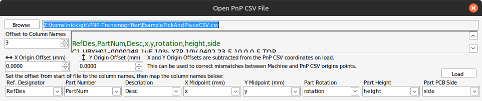

# Pick and Place Transmogrifier for Neoden YY1

A .NET application to convert pick-and-place CSV files exported from EDA tools (i.e Altium) into a machine compatible format (i.e. Neoden YY1 .csv format). Easy enough to use that every engineer I've given it to has been able to figure it out on their own in just a few minutes!

Save you Pick and Place project into an intermediate file format so you can easily come back to it later or make a cope for a different board easily without having to re-import your CSVs! Application .tmog files are gzip compressed JSON. Uncompressed JSON is also accepted. 

Go from from your PCB design to Neoden YY1 compatible CSV files in an easy GUI application! Assists with selecting nozzles and nozzle changes. Automatically returns the original nozzles to the heads at the end of placement. Prioritizies double placement of parts to speed up placement.

    

This C#/.NET application works natively with Windows but also works on Linux with Wine/Mono. You will need to install the [.NET 8.0 Desktop Runtime](https://dotnet.microsoft.com/en-us/download/dotnet/thank-you/runtime-desktop-8.0.10-windows-x64-installer) with Wine to run the applicaiton. Tested with Wine version 9.19. Older versions of Wine, particularly 9.0, may have issues with dotnet 8.

Originally developed as an internal tool, this application used icons from the Visual Studio 2022 Image Library which were not intended or licensed for use in an application like this. As a result, icons from the VS Library have been replaced with MIT licensed icons from [tabler-icons](https://github.com/tabler/tabler-icons).

Disclaimer: this project is provided for reference and without warranty. Use at your own risk, I am not responsible for damage to your property or yourself. This code has not been extensively tested with all versions of Neonden firmware, current or future. Always verify the validity of input data and output files. Monitor the machine when in motion: head crashes may occur.
