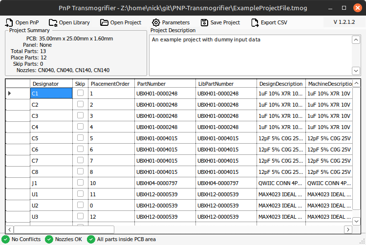
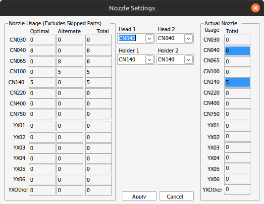
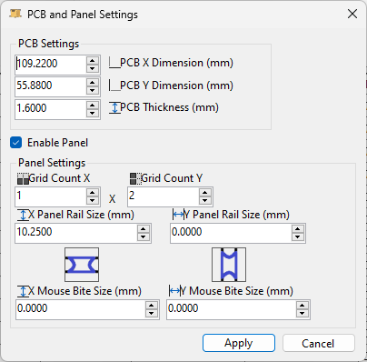
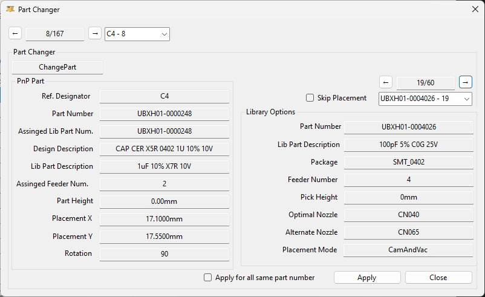

# Pick and Place Transmogrifier for Neoden YY1

A .NET application to convert pick-and-place CSV files exported from EDA tools (i.e Altium) into a machine compatible format (i.e. Neoden YY1 .csv format).

Go from from your PCB design to Neoden YY1 compatible CSV files in an easy GUI application! Assists with selecting nozzles and nozzle changes. Automatically returns the original nozzles to the heads at the end of placement. Prioritizies double placement of parts to speed up placement.

    

This C#/.NET application works natively with Windows but should also work on Linux with Wine/Mono.

Originally developed as an internal tool, this application used icons from the Visual Studio 2022 Image Library which were not intended or licensed for use in an application like this. As a result, icons from the VS Library have been removed and will need to be replaced.